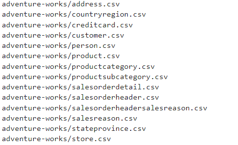

# MDS Session 2: EL with Airbyte & Python to Postgres & Snowflake Warehouse

In this session: 

- We discussed basic cmd/terminal commands and docker commands
- We pulled data from s3 into postgres using python (sample script in extract_load.py)
- We created an account on snowflake, and used a script to create a warehouse, database, and schemas.
- We pulled data from postgres into snowflake raw schema using Airbyte
- We created a dbt project for the data on snowflake, and initialized our great_expectations for the first time.

Adventure works data to be loaded on Snowflake:

